# GPA Calculator - Complete Documentation

## Table of Contents

1. [Project Overview](#project-overview)
2. [Features](#features)
3. [Technology Stack](#technology-stack)
4. [Installation & Setup](#installation--setup)
5. [User Guide](#user-guide)
6. [Architecture](#architecture)
7. [Code Structure](#code-structure)
8. [Data Persistence](#data-persistence)
9. [Performance Advisor](#performance-advisor)
10. [Responsive Design](#responsive-design)
11. [Print Functionality](#print-functionality)
12. [Browser Compatibility](#browser-compatibility)
13. [Screenshots](#screenshots)

---

## Project Overview

The **GPA Calculator** is a modern, responsive web application designed to help students calculate their Grade Point Average (GPA) based on their course grades and credit hours. Built with vanilla JavaScript, HTML5, and CSS3, the application provides an intuitive interface for tracking academic performance with features like data persistence, performance recommendations, and dark mode support.

### Key Highlights

- **Zero Dependencies**: Pure JavaScript, no frameworks required
- **Responsive Design**: Mobile-first approach with tablet and desktop breakpoints
- **Dark Mode**: Automatic system preference detection with manual toggle
- **Data Persistence**: LocalStorage-based saving and loading of course data
- **Performance Advisor**: AI-like recommendations for achieving target GPAs
- **Print-Friendly**: Optimized print styles with color preservation

---

## Features

### 1. GPA Calculation

- **5.0 Scale**: Standard Nigerian university grading system
- **Dynamic Course Entry**: Add unlimited courses dynamically
- **Grade Selection**: Dropdown with grades A through F
- **Credit Hours**: Support for 1-10 credit hours per course
- **Real-time Validation**: Form validation before calculation


### 2. Course Management

- **Add Courses**: Dynamically add new course rows
- **Remove Courses**: Delete individual courses (minimum 1 required)
- **Input Validation**: Required fields with placeholder text
- **Grade Mapping**:
  - A (Excellent) = 5.0
  - B (Very Good) = 4.0
  - C (Good) = 3.0
  - D (Fair) = 2.0
  - E (Pass) = 1.0
  - F (Fail) = 0.0

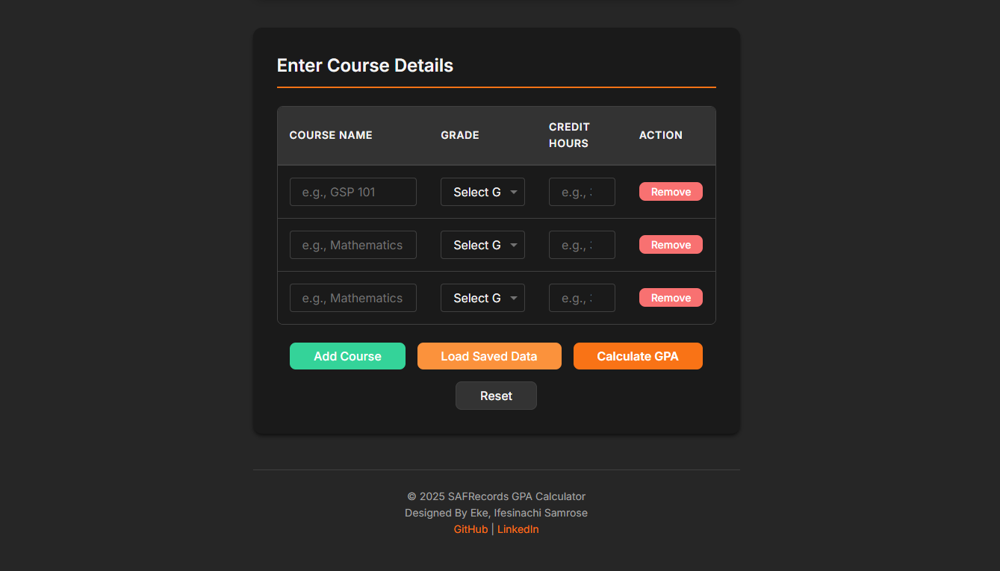

### 3. Results Display

- **GPA Summary Card**: Large, prominent GPA display with gradient background
- **Statistics**: Total courses and total credit hours
- **Course Breakdown Table**: Detailed view of each course with grade points
- **Animated Transitions**: Smooth fade-in and slide-in animations

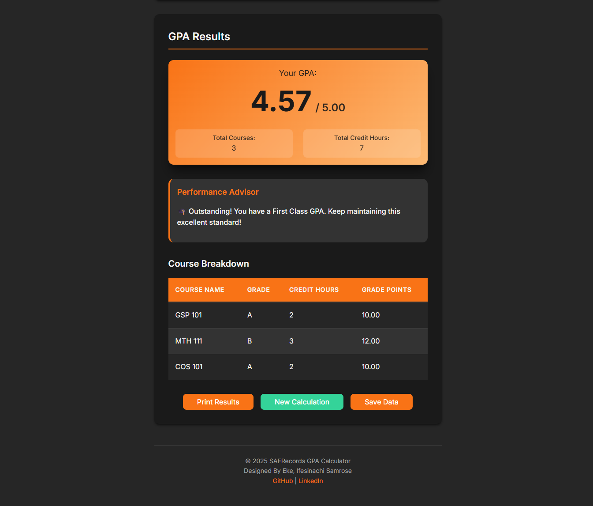

### 4. Performance Advisor

The Performance Advisor provides personalized recommendations for achieving specific GPA targets:

#### Target Classifications:

- **First Class**: 4.5 - 5.0 GPA
- **Second Class Upper**: 3.5 - 4.49 GPA
- **Second Class Lower**: 2.5 - 3.49 GPA

#### Recommendation Logic:

- Assumes 3 future courses (9 credit hours)
- Calculates required average grade for each target
- Provides specific grade recommendations
- Alerts if target is unachievable or already exceeded

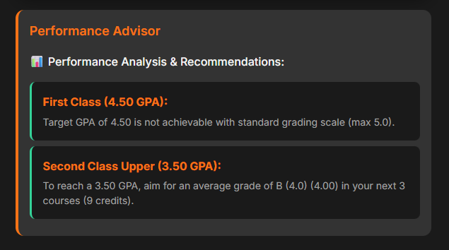

### 5. Data Persistence

- **Save Courses**: Save current course data to browser LocalStorage
- **Load Saved Data**: Retrieve previously saved courses with timestamp
- **Confirmation Dialogs**: Safety prompts before overwriting data
- **Last Saved Indicator**: Shows when data was last saved

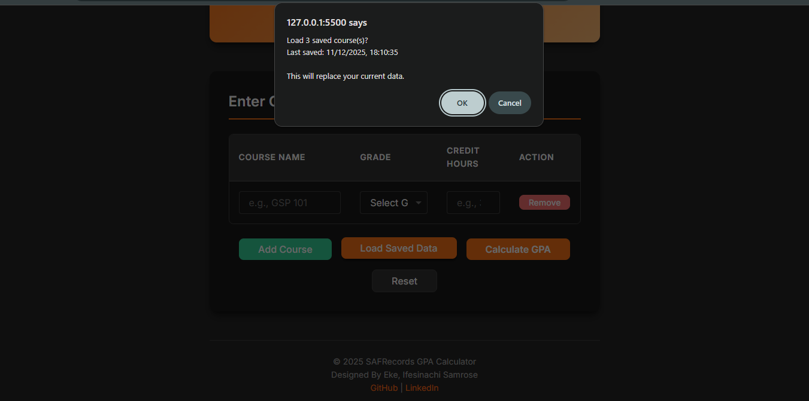

### 6. Theme Support

- **Light Mode**: Clean, bright interface with orange accents
- **Dark Mode**: Eye-friendly dark theme with adjusted colors
- **Auto-Detection**: Respects system color scheme preference
- **Manual Toggle**: Sun/moon icon button in header
- **Persistent**: Theme preference saved to LocalStorage

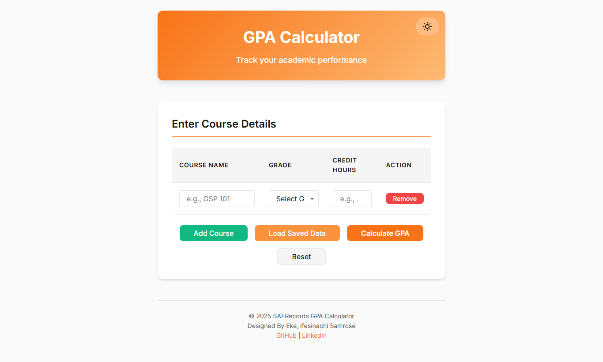
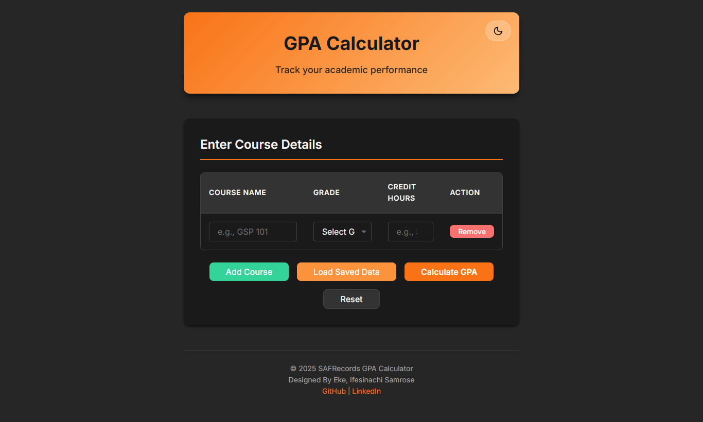

### 7. Print Functionality

- **Optimized Layout**: Removes unnecessary UI elements
- **Color Preservation**: Forces color printing for better readability
- **Page Break Control**: Prevents awkward breaks in content
- **Print-Only Styles**: Special styling for printed output

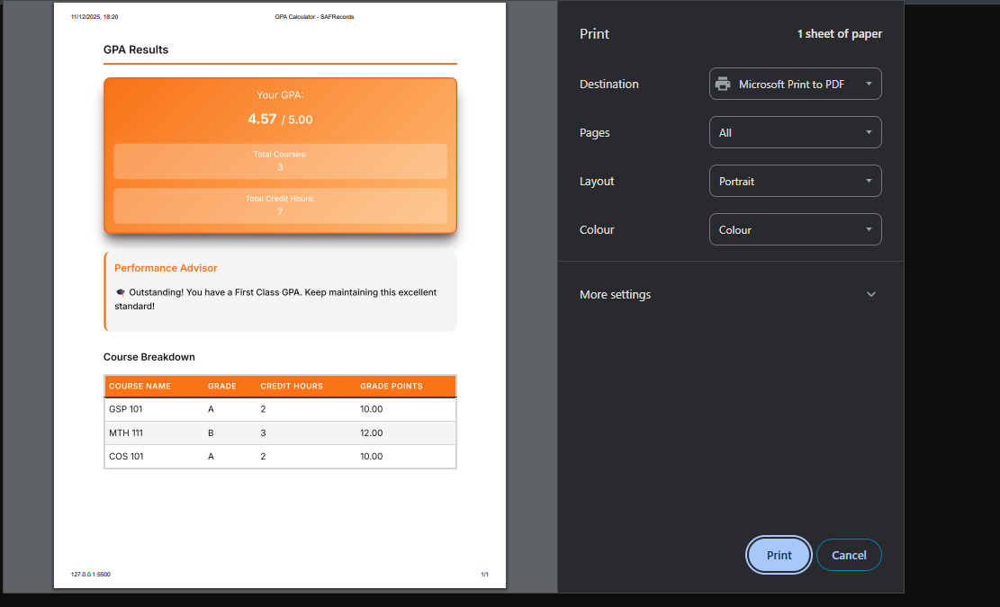

---

## Technology Stack

### Frontend

- **HTML5**: Semantic markup with accessibility attributes
- **CSS3**:
  - CSS Custom Properties (variables)
  - CSS Grid & Flexbox
  - Media Queries (mobile-first)
  - Animations & Transitions
- **JavaScript ES6+**:
  - Object literals for modular architecture
  - Arrow functions
  - Template literals
  - Destructuring
  - Array methods (forEach, map)

### APIs & Storage

- **LocalStorage API**: Client-side data persistence
- **Media Query API**: System theme detection
- **Print API**: Window.print() integration

### Design System

- **Color Palette**: Orange-based primary with green accents
- **Typography**: Inter font family from Google Fonts
- **Spacing**: rem-based spacing scale
- **Responsive Units**: rem for typography, px for borders

---

## Installation & Setup

### Prerequisites

- Modern web browser (Chrome 90+, Firefox 88+, Safari 14+, Edge 90+)
- Local web server (optional, for development)

### Quick Start

1. **Clone or Download** the project:

```bash
git clone <repository-url>
cd SAFIntern-final-Project
```

2. **Project Structure**:

```
SAFIntern-final-Project/
├── index.html              # Main HTML file
├── src/
│   ├── style.css          # Main stylesheet
│   ├── style.min.css      # Minified stylesheet (optional)
│   ├── main.js            # Application JavaScript
│   └── main.min.js        # Minified JavaScript (optional)
├── assets/
│   ├── sun-icon.svg       # Light mode icon
│   └── moon-icon.svg      # Dark mode icon
├── README.md              # Project overview
└── DOCUMENTATION.md       # This file
```

3. **Open in Browser**:
   - **Option A**: Double-click `index.html`
   - **Option B**: Use a local server:

     ```bash
     # Python 3
     python -m http.server 8000

     # Node.js (with http-server)
     npx http-server
     ```

   - Navigate to `http://localhost:8000`

### No Build Process Required

This is a vanilla JavaScript application with no build dependencies or compilation steps.

---

## User Guide

### Getting Started

#### 1. Enter Course Details


- Fill in the **Course Name** (e.g., "Mathematics 101")
- Select a **Grade** from the dropdown (A through F)
- Enter **Credit Hours** (1-10)
- Click **Add Course** to add more rows

#### 2. Calculate GPA

- Click **Calculate GPA** button
- Results section appears with smooth animation
- View your GPA, total courses, and credit hours

#### 3. Review Performance Advisor

- Scroll down to see personalized recommendations
- Review required grades for target classifications
- Plan future course selections strategically

#### 4. Save Your Data (Optional)

- Click **Save Data** button
- Confirmation message shows number of courses saved
- Data persists in browser even after closing tab

#### 5. Load Saved Data

- Click **Load Saved Data** button
- Confirmation dialog shows last saved timestamp
- Confirm to populate form with saved courses

#### 6. Print Results

- Click **Print Results** button
- Browser print dialog opens
- Print or save as PDF

#### 7. Start New Calculation

- Click **New Calculation** button
- Form resets to initial state
- Results section hidden

### Keyboard Navigation

- **Tab**: Navigate between fields
- **Enter**: Submit form (when in input fields)
- **Escape**: Close confirmation dialogs
- **Space**: Toggle checkboxes/buttons

### Tips & Best Practices

1. **Save Regularly**: Use the Save Data feature to preserve your work
2. **Verify Inputs**: Double-check course names, grades, and credit hours
3. **Use Performance Advisor**: Plan future courses based on recommendations
4. **Print for Records**: Save PDF copies of your GPA reports
5. **Theme Selection**: Choose theme based on environment (dark mode for night)

---

## Architecture

### Design Pattern: Module Pattern

The application uses an **object literal pattern** for organizing code into logical modules. Each module handles specific functionality and can be independently tested and maintained.

```
Application Architecture
│
├── ThemeManager          # Theme switching and persistence
├── CourseManager         # Course CRUD operations
├── DataManager           # LocalStorage operations
├── GPACalculator         # GPA calculation logic
├── PerformanceAdvisor    # Recommendation engine
├── ResultsManager        # Results display logic
└── FormHandlers          # Event handler functions
```

### Data Flow

```
User Input → CourseManager.getCourses()
           → GPACalculator.calculate()
           → ResultsManager.displayResults()
           → PerformanceAdvisor.displayAdvisor()
```

### State Management

The application uses **DOM-based state management** with minimal in-memory state:

- Current theme stored in `data-theme` attribute
- Course data stored in form inputs
- Results generated on-demand from course data
- LocalStorage for persistence

---

## Code Structure

### HTML Structure (index.html)

```html
<div class="container">
  <header>
    <!-- Theme toggle button -->
    <!-- Title and subtitle -->
  </header>

  <main>
    <!-- Input Section -->
    <section class="input-section">
      <form id="gpaForm">
        <!-- Course table -->
        <!-- Action buttons -->
      </form>
    </section>

    <!-- Results Section -->
    <section class="results-section">
      <!-- GPA summary card -->
      <!-- Performance advisor -->
      <!-- Course breakdown table -->
      <!-- Result actions -->
    </section>
  </main>

  <footer>
    <!-- Copyright and links -->
  </footer>
</div>
```

### CSS Architecture (style.css)

#### Variable Structure

```css
:root {
  /* Color palette - original variables */
  --orange-500: #f97316;
  --gray-900: #171717;
  /* ... more colors */

  /* Typography */
  --font-family: "Inter", sans-serif;
  --font-size-base: 1rem;
  /* ... more font sizes */

  /* Spacing */
  --spacing-md: 1rem;
  /* ... more spacing */

  /* Other design tokens */
  --radius-md: 0.5rem;
  --transition-fast: 150ms ease-in-out;
}
```

#### Dark Mode Override

```css
[data-theme="dark"] {
  /* Reassign color variables */
  --orange-500: #f97316;
  --gray-900: #f5f5f5; /* Inverted for dark mode */
  /* ... */
}
```

#### Responsive Breakpoints

- **Mobile**: Default (0px+)
- **Tablet**: 48rem (768px)
- **Desktop**: 64rem (1024px)

### JavaScript Modules (main.js)

#### ThemeManager

```javascript
ThemeManager = {
  getPreferredTheme()   // Detect system preference
  setTheme(theme)       // Apply theme to DOM
  toggleTheme()         // Switch between themes
  init()                // Initialize theme system
}
```

#### CourseManager

```javascript
CourseManager = {
  createCourseRow()          // Generate new course row
  addCourse()                // Add course to table
  removeCourse(button)       // Remove specific course
  getCourses()               // Extract course data from DOM
  validateCourses()          // Validate form inputs
  loadCoursesIntoForm(data)  // Populate form with saved data
}
```

#### GPACalculator

```javascript
GPACalculator = {
  calculate(courses)      // Calculate GPA and stats
  getGradeLabel(value)    // Convert numeric grade to letter
}
```

#### DataManager

```javascript
DataManager = {
  saveCourses(courses)    // Save to LocalStorage
  loadCourses()           // Load from LocalStorage
  clearSavedData()        // Remove saved data
  getLastSavedDate()      // Get save timestamp
}
```

#### PerformanceAdvisor

```javascript
PerformanceAdvisor = {
  analyzePerformance(gpa, credits, points)      // Generate recommendations
  calculateTargetGrades(current, target)        // Calculate needed grades
  getClosestGrade(value)                        // Get grade label
  displayAdvisor(results)                       // Show recommendations
}
```

---

## Data Persistence

### LocalStorage Schema

#### Saved Courses

```javascript
// Key: "gpa_calculator_courses"
[
  {
    courseName: "Mathematics 101",
    grade: 5,
    credit: 3,
  },
  {
    courseName: "Physics 201",
    grade: 4,
    credit: 4,
  },
  // ... more courses
];
```

#### Last Saved Timestamp

```javascript
// Key: "gpa_calculator_last_saved"
"2025-12-11T10:30:45.123Z"; // ISO 8601 format
```

#### Theme Preference

```javascript
// Key: "theme"
"dark"; // or "light"
```

### Storage Limits

- **LocalStorage Capacity**: ~5-10MB per domain
- **Estimated Course Capacity**: ~10,000+ courses
- **Practical Limit**: 100-200 courses recommended

### Data Security

- Data stored locally in browser only
- No server transmission
- User can clear via browser settings
- No sensitive information stored

---

## Performance Advisor

### Calculation Methodology

#### Formula

```
Required Total Grade Points = Target GPA × Total Future Credits
Needed Grade Points = Required Total - Current Grade Points
Needed Average Grade = Needed Grade Points ÷ Future Credits
```

#### Assumptions

- **Future Courses**: 3 courses
- **Future Credits**: 9 credit hours (3 credits each)
- **Scale**: 5.0 maximum grade

#### Example Calculation

```javascript
Current: GPA = 3.2, Credits = 24, Grade Points = 76.8
Target: First Class (4.5 GPA)

Future Credits = 24 + 9 = 33
Required Total = 4.5 × 33 = 148.5
Needed Points = 148.5 - 76.8 = 71.7
Average Grade = 71.7 ÷ 9 = 7.97

Result: "Target not achievable" (exceeds 5.0 scale)
```

### Recommendation Types

#### 1. Achievable Target

```
"To reach a 3.50 GPA, aim for an average grade of B (4.0)
in your next 3 courses (9 credits)."
```

#### 2. Unachievable Target

```
"Target GPA of 4.50 is not achievable with standard
grading scale (max 5.0)."
```

#### 3. Already Exceeded

```
"You've already exceeded this target! Keep up the great work! 🎉"
```

---

## Responsive Design

### Mobile-First Approach

The application is built with a **mobile-first strategy**, meaning base styles target small screens and progressively enhance for larger devices.

#### Base Styles (Mobile: 0-767px)

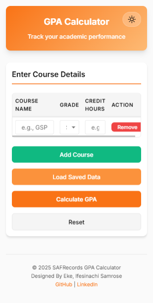

- Single column layout
- Stacked form buttons
- Full-width inputs
- Compressed spacing
- Smaller font sizes
- Scrollable tables

#### Tablet Styles (768px-1023px)

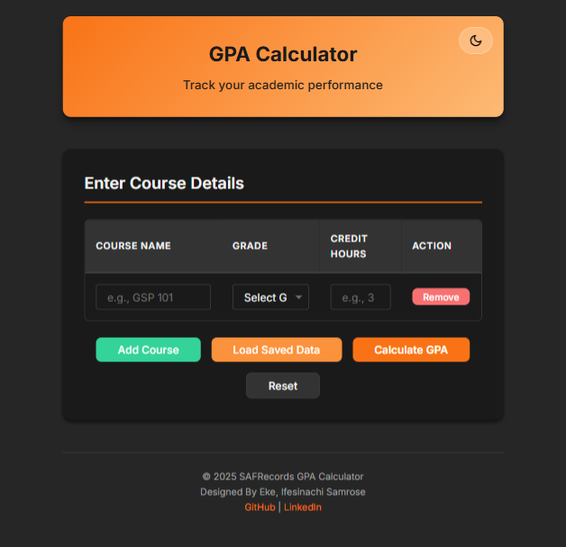

- Two-column stats grid
- Horizontal button layout
- Increased padding
- Larger typography
- Better table spacing

#### Desktop Styles (1024px+)


- Maximum width container (700px)
- Hover effects enabled
- Largest font sizes
- Generous spacing
- Enhanced shadows

### Touch-Friendly Design

- **Minimum Touch Target**: 44×44px (Apple HIG standard)
- **Button Padding**: Spacious tap areas
- **No Hover Dependencies**: All actions accessible via tap
- **Tap Highlight**: Transparent for clean appearance

---

## Print Functionality

### Print Optimization

#### Hidden Elements

The following UI elements are hidden when printing:

- Header (title and theme toggle)
- Input section (form)
- Form action buttons
- Result action buttons
- Footer
- Theme toggle button

#### Visible Elements

- Results section title
- GPA summary card (with full colors)
- Performance Advisor (if displayed)
- Course breakdown table
- All colors preserved for clarity


### Print Styles

```css
@media print {
  /* Force color printing */
  * {
    -webkit-print-color-adjust: exact !important;
    print-color-adjust: exact !important;
  }

  /* Hide unnecessary sections */
  header,
  .input-section,
  footer {
    display: none !important;
  }

  /* Prevent page breaks inside sections */
  .summary-card,
  .performance-advisor {
    page-break-inside: avoid;
  }

  /* Use specific colors instead of variables */
  .summary-card {
    background: linear-gradient(135deg, #f97316, #fdba74) !important;
  }
}
```

### Print Tips

1. **Use Chrome/Edge**: Best color printing support
2. **Enable Background Graphics**: In print dialog settings
3. **Set Margins**: Use default or custom margins
4. **Portrait Orientation**: Recommended for best layout
5. **Save as PDF**: For digital records

---

## Browser Compatibility

### Fully Supported Browsers

| Browser | Version | Notes                         |
| ------- | ------- | ----------------------------- |
| Chrome  | 90+     | Full support                  |
| Firefox | 88+     | Full support                  |
| Safari  | 14+     | Full support                  |
| Edge    | 90+     | Full support (Chromium-based) |
| Opera   | 76+     | Full support                  |

### Feature Support Matrix

| Feature               | Chrome | Firefox | Safari | Edge |
| --------------------- | ------ | ------- | ------ | ---- |
| CSS Grid              | ✅     | ✅      | ✅     | ✅   |
| CSS Custom Properties | ✅     | ✅      | ✅     | ✅   |
| LocalStorage          | ✅     | ✅      | ✅     | ✅   |
| Media Queries API     | ✅     | ✅      | ✅     | ✅   |
| Print Color Adjust    | ✅     | ⚠️      | ⚠️     | ✅   |
| ES6+ JavaScript       | ✅     | ✅      | ✅     | ✅   |

Legend: ✅ Full Support | ⚠️ Partial Support | ❌ No Support

### Known Issues

#### Firefox Print Colors

- **Issue**: Background colors may not print by default
- **Solution**: Enable "Print backgrounds" in print dialog

#### Safari Dark Mode

- **Issue**: May not respect system preference immediately
- **Solution**: Manually toggle theme using button

#### Mobile Safari Input Zoom

- **Issue**: Input fields zoom in on focus
- **Solution**: Use `font-size: 16px` minimum (already implemented)

---

## Screenshots

### Application Interface

#### 1. Landing Page (Light Mode)


_Clean, modern interface with orange gradient header and course entry form_

#### 2. Landing Page (Dark Mode)


_Eye-friendly dark theme with adjusted colors and maintained contrast_

#### 3. Course Entry Form


_Dynamic form with add/remove functionality and input validation_

#### 4. Multiple Courses Added

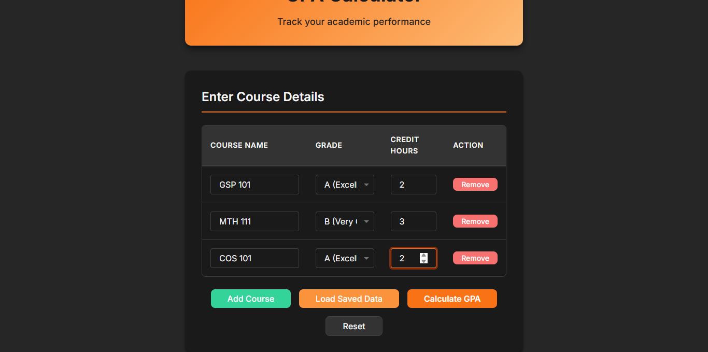
_Example showing multiple courses with different grades and credits_

#### 5. GPA Results - Summary Card


_Large GPA display with gradient background and key statistics_

#### 6. Performance Advisor - First Class Target

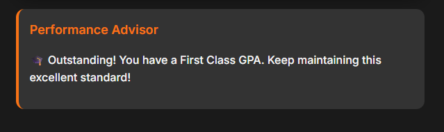
_Recommendations for achieving First Class honors (4.5+ GPA)_

#### 7. Performance Advisor - Multiple Targets


_Multiple classification targets with specific grade requirements_

#### 8. Course Breakdown Table

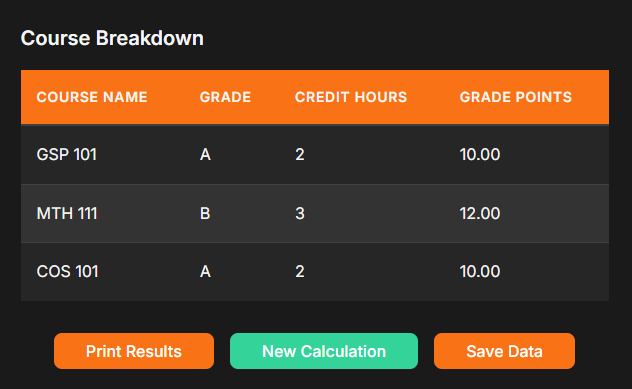
_Detailed table showing each course with calculated grade points_

### Responsive Design

#### 9. Mobile View - Portrait

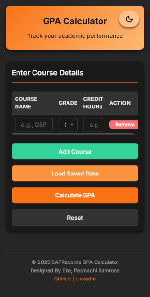
_Optimized single-column layout for smartphones (375px width)_

#### 10. Mobile View - Form Actions


_Stacked buttons for easy thumb access on mobile devices_

#### 11. Tablet View - Landscape


_Enhanced layout with more breathing room (768px width)_

#### 12. Desktop View - Full Width


_Spacious desktop layout with hover effects (1440px width)_

### Print Functionality

#### 13. Print Preview


_Optimized print layout with colors preserved_
### Performance Scenarios

#### 14. Excellent Performance (4.8 GPA)


_Message for students already exceeding First Class requirements_

## Troubleshooting

### Common Issues

#### Issue: Theme not saving

**Symptoms**: Theme resets to light mode after browser refresh
**Solution**:

1. Check browser LocalStorage is enabled
2. Verify not in Private/Incognito mode
3. Check available storage space

#### Issue: Saved data not loading

**Symptoms**: No courses loaded when clicking "Load Saved Data"
**Solution**:

1. Verify data was saved first (click Save Data)
2. Check browser console for errors (F12)
3. Try clearing browser cache and re-saving

#### Issue: Print colors not showing

**Symptoms**: Printed output is black and white
**Solution**:

1. Enable "Background graphics" in print settings
2. Use Chrome or Edge browser for best results
3. Check printer color settings

#### Issue: Form validation not working

**Symptoms**: Can calculate GPA with empty fields
**Solution**:

1. Refresh the page
2. Ensure JavaScript is enabled
3. Check browser console for errors

#### Issue: Mobile inputs zooming in

**Symptoms**: Screen zooms when tapping input fields
**Solution**:

- Already handled in CSS with 16px minimum font-size
- If still occurring, check browser zoom level is 100%

### Debug Mode

Enable console logging for troubleshooting:

```javascript
// In browser console
localStorage.setItem("debug", "true");
```

Then check console for detailed logs of:

- Theme changes
- Course additions/removals
- GPA calculations
- Save/Load operations

---

## Future Enhancements

### Planned Features

1. **Export Options**

   - Export to CSV
   - Export to JSON
   - Share results via link

2. **Enhanced Analytics**

   - GPA trends over semesters
   - Visual charts and graphs
   - Historical comparison

3. **Advanced Calculations**

   - CGPA (Cumulative GPA)
   - Semester-based tracking
   - Weighted courses support

4. **User Accounts**

   - Cloud sync across devices
   - Multiple semester management
   - Profile customization

5. **Accessibility**

   - Screen reader optimization
   - High contrast mode
   - Keyboard shortcuts

6. **Internationalization**
   - Multi-language support
   - Different grading systems
   - Localized date formats

---

## Contributing

### Development Setup

1. Fork the repository
2. Create a feature branch
3. Make your changes
4. Test thoroughly across browsers
5. Submit a pull request

### Code Style Guidelines

- **Indentation**: 2 spaces
- **Quotes**: Double quotes for HTML, single for JavaScript
- **Naming**: camelCase for JavaScript, kebab-case for CSS
- **Comments**: JSDoc style for functions

### Testing Checklist

- [ ] Test in Chrome, Firefox, Safari, and Edge
- [ ] Test responsive breakpoints (mobile, tablet, desktop)
- [ ] Test dark mode and light mode
- [ ] Test print functionality
- [ ] Test LocalStorage save/load
- [ ] Test all form validations
- [ ] Check console for errors
- [ ] Verify accessibility (keyboard navigation)

---

## Credits

**Developer**: Eke, Ifesinachi Samrose

**Contact**:

- GitHub: [@SamIfesi](https://github.com/SamIfesi)
- LinkedIn: [Sam Ifesi](https://www.linkedin.com/in/sam-ifesi)

**Technologies Used**:

- [Inter Font](https://fonts.google.com/specimen/Inter) by Rasmus Andersson
- SVG icons for theme toggle
- LocalStorage API for data persistence

---

## License

This project is open source and available for educational purposes.

---

## Changelog

### Version 1.0.0 (December 11, 2025)

- Initial release
- Core GPA calculation functionality
- Dark mode support
- LocalStorage data persistence
- Performance Advisor feature
- Responsive design (mobile, tablet, desktop)
- Print optimization

---

## Support

For issues, questions, or suggestions:

1. Check this documentation first
2. Review the troubleshooting section
3. Open an issue on GitHub
4. Contact the developer via LinkedIn

---

**Last Updated**: December 11, 2025  
**Version**: 1.0.0  
**Status**: Production Ready
